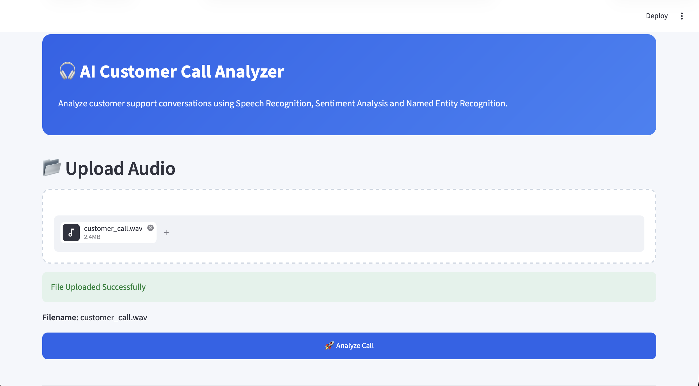
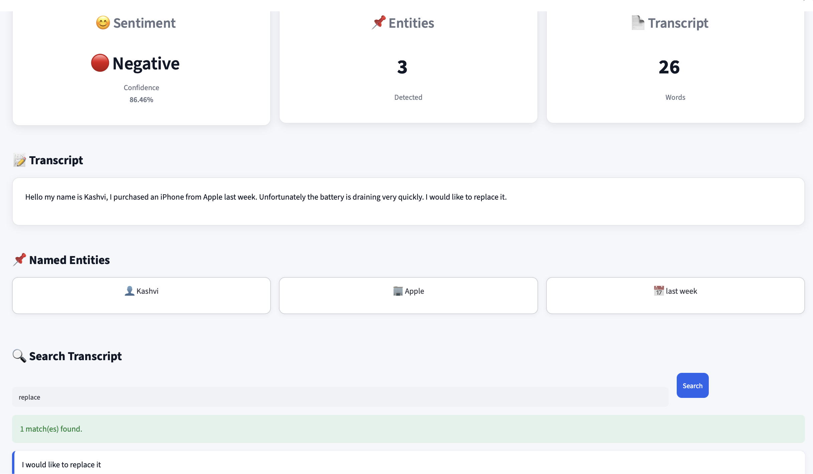

# 🎧 AI Customer Call Analyzer

An AI-powered application that analyzes customer support call recordings using Speech Recognition and Natural Language Processing (NLP).

The application converts customer audio into text, identifies customer sentiment, extracts important entities, enables transcript search, and generates downloadable reports through an interactive Streamlit dashboard.

---

## Features

- 🎤 Speech-to-Text transcription using OpenAI Whisper
- 😊 Sentiment Analysis using RoBERTa (Hugging Face Transformers)
- 📌 Named Entity Recognition using spaCy
- 🔍 Transcript keyword search
- 📄 Downloadable analysis report
- 🖥️ Interactive Streamlit dashboard

---

## Tech Stack

- Python
- Streamlit
- OpenAI Whisper
- Hugging Face Transformers
- spaCy
- PyTorch
- scikit-learn
- Pandas

---

## Project Structure

```
customer-support-ai/
│
├── app.py
├── pipeline.py
├── requirements.txt
├── README.md
│
├── assets/
|   ├── dashboard.png
|   ├── image.png
│
└── utils/
    ├── speech.py
    ├── sentiment.py
    ├── ner.py
    ├── search.py
    └── report.py
```

---

## Installation

Clone the repository

```bash
git clone <repository-url>
cd customer-support-ai
```

Create a virtual environment

```bash
python -m venv venv
```

Activate the environment

### macOS/Linux

```bash
source venv/bin/activate
```

### Windows

```bash
venv\Scripts\activate
```

Install dependencies

```bash
pip install -r requirements.txt
```

Download the spaCy model

```bash
python -m spacy download en_core_web_sm
```

---

## Run the Application

```bash
streamlit run app.py
```

The application will open in your browser.

---

## Workflow

1. Upload a customer support call.
2. Convert speech to text using Whisper.
3. Perform sentiment analysis.
4. Extract named entities.
5. Search the transcript.
6. Download the generated report.

---

## Sample Output

- Transcript
- Sentiment
- Named Entities
- Search Results
- Downloadable Report

---

## Future Improvements

- PDF report generation
- Conversation summarization
- Speaker diarization
- Emotion detection
- Semantic transcript search
- Support for multiple languages

---
## Dashboard





## Author

**Kashvee Singh**
